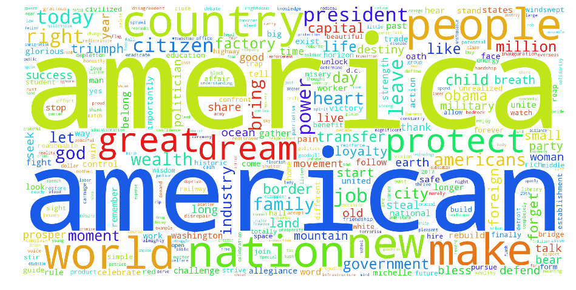

# Donald J. Trump Inauguration Speech Visualization

***This is a non-partisan analysis of President Trump's Inauguration speech. It is in no way intended to disparage or endorse any politician or party.***
___

As a matter of interest, I wanted to do a little text exploration to see what sorts of things Donald Trump spoke about in his inaugural speech on January 20, 2017.

Using spaCy, I tokenized and lemmatized the words in the speech and removed stop words. Once I removed stop words, I used the `wordcloud` package to create a cloud of the 385 remaining unique words and their respective frequencies.

```python
import matplotlib.pyplot as plt
from wordcloud import WordCloud

wc = WordCloud(width=2000, height=1000, max_words=150, background_color='white')
wc.fit_words(word_freq)
fig = plt.figure(figsize=(16, 8))
ax = fig.add_subplot(111)
ax.axis('off')
ax.imshow(wc)
plt.show()
```

I think his speech can be summed up in pretty much one word:
###'Murica

<p align="center">
  
</p>
